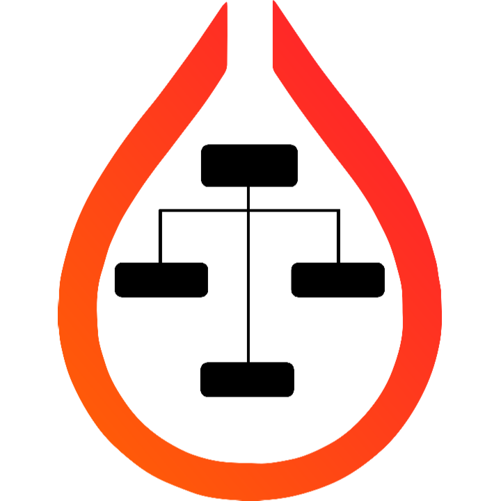

<div align='center'>

<h2>HyprParser </h2>

A parser for Hyprland's configuration files written in Rust 🚀🦀

<br>

[](https://crates.io/crates/hyprparser)

[Hyprland Configuration Documentation](https://wiki.hyprland.org/Configuring/Configuring-Hyprland)

</div>

## Usage
HyprParser is available on [Crates.io](https://crates.io/crates/hyprparser). It can be added as a dependency with:

```bash
$ cargo add hyprparser
```

Here's an example usage:

```toml
# Cargo.toml

[dependencies]
hyprparser = "0.1.1"
```

```rust
// main.rs

use hyprparser::parse_config;
use std::{env, fs, path::Path};

fn main() {
    let config_path = Path::new(&env::var("XDG_CONFIG_HOME").unwrap_or_else(|_| {
        let home = env::var("HOME").unwrap_or_else(|_| ".".to_string());
        format!("{}/.config", home)
    }))
    .join("hypr/hyprland.conf");

    let config_str = fs::read_to_string(&config_path).unwrap();

    let mut parsed_config = parse_config(&config_str);

    parsed_config.add_entry("decoration", "rounding = 10");
    parsed_config.add_entry("decoration.blur", "enabled = true");
    parsed_config.add_entry("decoration.blur", "size = 10");
    parsed_config.add_entry_headless("$terminal", "kitty");

    let updated_config_str = parsed_config.to_string();

    fs::write(&config_path, updated_config_str).unwrap();

    println!("Updated hyprland.conf with new configuration.");
}
```

## TODO
- [ ] Color formatting tests

## Credits
- [Nyx](https://github.com/nnyyxxxx) - The parser (everything), [HyprGUI](https://github.com/nnyyxxxx/hyprgui)
- [Adam](https://github.com/adamperkowski) - Code optimization, unit tests, documentation updates, [HyprGUI](https://github.com/nnyyxxxx/hyprgui)
- [Vaxry](https://github.com/vaxerski) - Hyprland
- [Hyprland](https://github.com/hyprwm/Hyprland) - The window manager

<h6 align='center'>Copyright (C) 2024 HyprUtils<h6>
